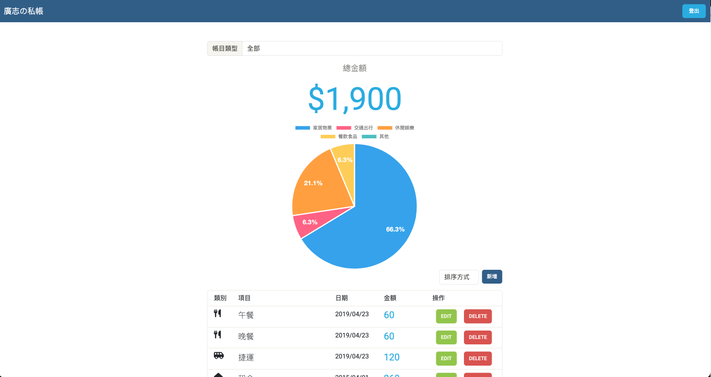

# A3 : 老爸的私房錢  (AC 3 A3)


## Screenshot - 畫面截圖



## About - 介紹
這是一個用Express製作的私帳清單。
使者可以登入自己的帳戶紀錄自己的私帳。

## Environment - 開發環境
* node v14.16.0

## Development Tools - 開發工具
* MongoDB
* nodemon
* bcryptjs": "^2.4.3",
* connect-flash": "^0.1.1",
* express": "^4.18.2",
* express-handlebars": "^4.0.3",
* express-session": "^1.17.3",
* method-override": "^3.0.0",
* mongoose": "^5.9.7",
* passport": "^0.6.0",
* passport-facebook": "^3.0.0",
* passport-local": "^1.0.0"

## Features - 功能

1. 使用者可以登入，登出，註冊
2. 使用者可以CRUD自己的帳目
3. 使用者可以依照帳目類型來瀏覽帳目
4. 使用者可以sort賬目的排序
5. 使用者可以看到一個圓餅圖 

## Installation and execution - 安裝與執行步驟

1.開啟Terminal, Clone此專案至本機:
```
git clone https://github.com/klu0926/expanse-tracker.git
```

2.進入存放此專案的資料夾
```
cd expanse-tracker
```

3.安裝 npm 套件
```
npm install
```

4.安裝nodemon (如果已有可跳過)
```
npm install -g nodemon
```

5.使用MongoDB cloud 獲得你的 connection string
```
mongodb+srv://<username>:<password>@<cluster>.pk4dwnp.mongodb.net/?retryWrites=true&w=majority
```

6.在專案內創造一個.env檔案，並在其輸入你的 MongoDB connection string
```
MONGODB_URL=mongodb+srv://<username>:<password>@<cluster>.pk4dwnp.mongodb.net/<database name>?retryWrites=true&w=majority
```

7.製作種子資料
```
npm run seed
```
8.製作 .env檔案，可以參考 .env.example
```
PORT=
MONGODB_URI=
SESSION_SECRET=
FACEBOOK_APP_CALLBACK=
FACEBOOK_APP_ID=
FACEBOOK_APP_SECRET=
```

9.啟動伺服器 (這會使用 nodemon 啟動專案)
```
npm run dev 
```

## NPM Scripts

* 種子資料
```
npm run seed
```

* 刪除全部在資料庫內的資料,包含User, Category, Record的資料
```
npm run deleteAllData
```

## 種子資料
種子資料除了生出帳目(Records)以外，也會產生 2 個使用者資料
使用者是依照 user.json 資料來設定
```
{
  "results": [
    {
      "name": "廣志",
      "email": "111@example.com",
      "password": "111"
    },
    {
      "name": "小新",
      "email": "222@example.com",
      "password": "222"
    }
  ]
}
```


